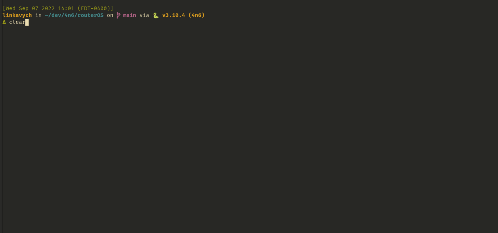

# routerOS Artifact Collector

routerOS artifact collecton is a simple tool designed for inceident response on potentially compromised
routerOS products. It will run native comands, via ssh, on the target router and collect
relevant forensic data for further analysis.

***

### Inspired by:
- @tclahr - [Unix-like Artifact Collector](https://github.com/tclahr/uac)
